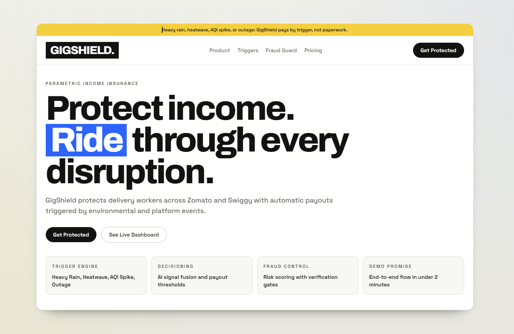
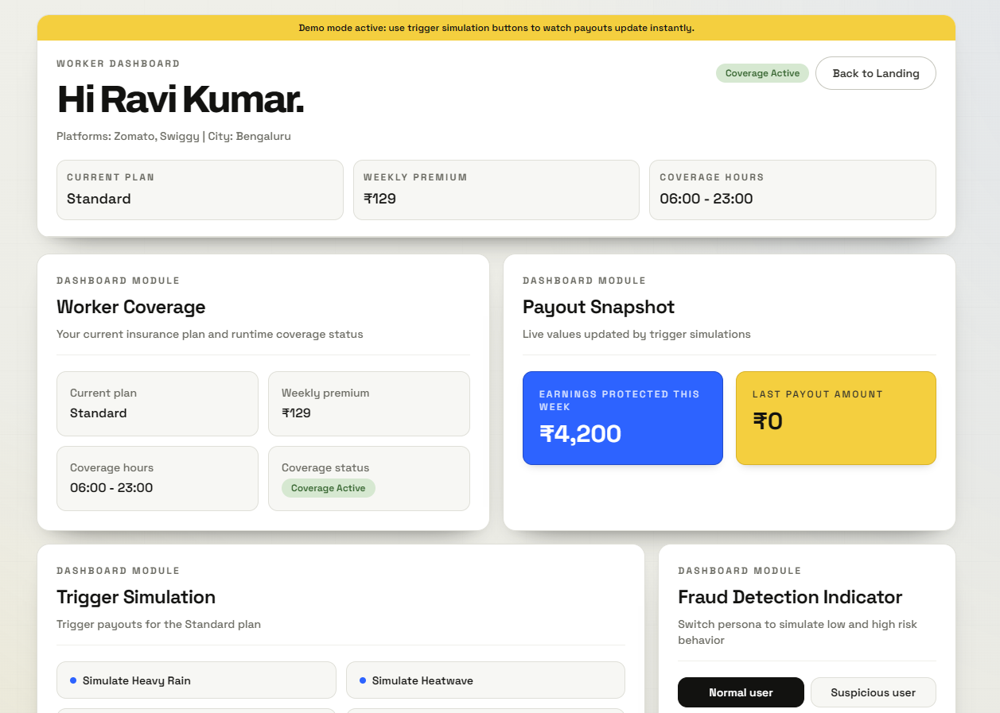
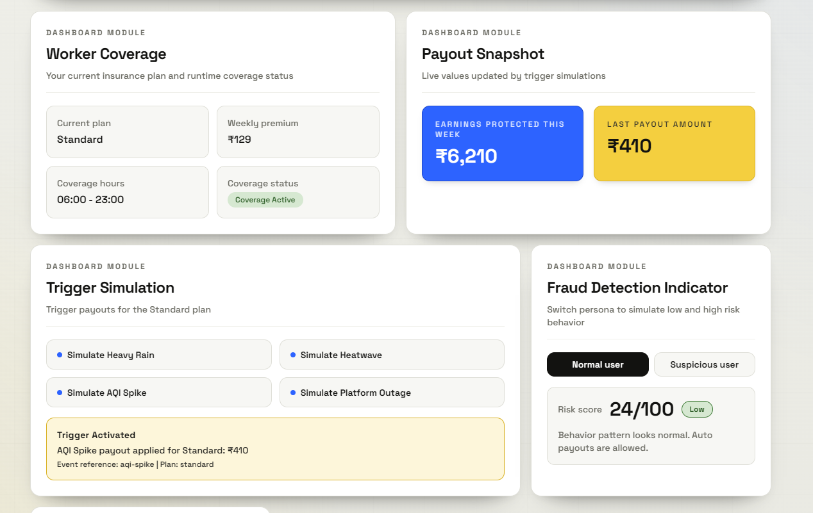

# 🛡️ GigShield

AI-powered parametric income insurance for food delivery workers. Protect your earnings against unexpected events with instant payouts triggered by real-world conditions.

**[🚀 Live Demo](https://gigshield-demo.vercel.app)** | 
**[📖 Repository](https://github.com/Avisav24/GigShield)**

---

## 📸 Screenshots

### Landing Page


_Hero page introducing GigShield's coverage promise with product features and call-to-action buttons._

### Dashboard – Coverage Overview


_Real-time earnings protection and plan details at a glance._

### Dashboard – Trigger Simulation


_Simulate weather and platform events to see instant payout calculations._

### Dashboard – Fraud Detection


_Risk scoring and verification requirements for worker protection._

---

## ✨ Features

- **Parametric Insurance**: Instant payouts triggered by external events (weather, platform outages)
- **Real-time Earnings Protection**: Track protected earnings and see payouts calculated instantly
- **Plan Variants**: Choose from Basic, Standard, or Pro plans with flexible coverage hours
- **Fraud Detection**: AI-powered risk scoring with verification workflows
- **Activity Tracking**: Monitor orders completed, active status, and last engagement time
- **Responsive Design**: Clean, modern UI optimized for desktop and mobile
- **Mock Data**: Fully functional demo with pre-populated worker profiles and event scenarios

---

## 🛠️ Tech Stack

- **Frontend Framework**: React 19.2.4
- **Build Tool**: Vite 8.0.1
- **Styling**: Tailwind CSS 3.4.17 with custom design system
- **Routing**: react-router-dom 7.13.1
- **Deployment**: Vercel (SPA configured)
- **Package Manager**: npm 10+

---

## 🚀 Quick Start

### Prerequisites

- Node.js 18+ and npm

### Installation

```bash
# Clone the repository
git clone https://github.com/Avisav24/GigShield.git
cd GigShield

# Install dependencies
npm install

# Start development server
npm run dev
```

Open [http://localhost:5173](http://localhost:5173) in your browser to see the app.

### Build for Production

```bash
npm run build
npm run preview
```

---

## 📁 Project Structure

```
src/
├── components/          # Reusable UI components
│   ├── Card.jsx         # Card wrapper with board styling
│   ├── PlanSummary.jsx  # Plan details and coverage status
│   ├── EarningsSnapshot.jsx
│   ├── TriggerSimulationPanel.jsx
│   ├── FraudDetectionIndicator.jsx
│   └── ActivityPanel.jsx
├── pages/               # Page components
│   ├── LandingPage.jsx  # Public landing/intro page
│   └── DashboardPage.jsx # Main worker dashboard
├── data/                # Mock data (JSON)
│   ├── userProfile.json
│   ├── planDetails.json
│   ├── triggerEvents.json
│   ├── fraudScores.json
│   └── activityData.json
├── utils/               # Helper functions
│   ├── format.js        # Currency and time formatting
│   ├── payout.js        # Payout calculations
│   └── fraud.js         # Risk scoring logic
├── App.jsx              # Root component with routing
├── main.jsx             # App entry point
└── index.css            # Global styles and Tailwind imports
```

---

## 🎮 Demo Flow

1. **Landing Page**: Explore GigShield's features and value proposition
2. **Dashboard**: View your active plan and earnings protection
3. **Trigger Events**: Simulate weather or platform events to see instant payouts
4. **Risk Assessment**: Toggle fraud detection persona (normal/suspicious) to see risk scoring
5. **Activity Log**: Monitor your delivery activity and engagement status

### Example Triggers

- **Heavy Rain**: ₹150-500 depending on plan
- **Heatwave**: ₹200-600 depending on plan
- **Air Quality Index Spike**: ₹150-500 depending on plan
- **Platform Outage**: ₹300-1000 depending on plan

---

## Adversarial Defense & Anti-Spoofing Strategy

GigShield now includes a dedicated anti-spoofing verification flow designed for coordinated fraud-ring attacks (for example, mass GPS spoofing from organized groups).

### 1. The Differentiation

Our architecture separates genuine distress from spoofing by combining trigger eligibility with risk-adaptive identity checks:

- **Step A: Trigger + policy check**
	Payouts are first checked against plan rules (coverage hours, daily cap, trigger validity).
- **Step B: Behavioral risk scoring**
	Suspicious behavior profiles are classified into risk bands.
- **Step C: Adaptive proof-of-presence challenge**
	If risk is high, payout is paused until the partner completes a **randomized selfie gesture challenge** in-session.

This random gesture requirement raises attack cost because fraud actors must produce a live, context-specific response instead of replaying static proofs.

### 2. The Data

Beyond raw GPS coordinates, the defense strategy analyzes a multi-signal profile:

- **Risk persona and behavior score** from fraud scoring logic
- **Coverage and payout pattern** (frequency, cap exhaustion speed, trigger clustering)
- **Platform linkage footprint** (cross-platform account patterns)
- **Session continuity signals** (login context, recent activity cadence)
- **Challenge telemetry** from selfie verification flow:
	- challenge generated time
	- challenge completion time
	- challenge type (random gesture prompt)
	- verification status and freshness window

These combined signals help detect synchronized spoofing campaigns where many accounts attempt similar payouts in compressed time windows.

### 3. The UX Balance

To avoid penalizing honest workers in bad weather or unstable networks, GigShield uses a progressive workflow:

- **Low/Medium risk**: payouts continue without extra friction.
- **High risk**: payout is temporarily held with a clear reason and a guided verification path.
- **Fast re-approval window**: once verified, the session remains approved for a time window, so workers are not repeatedly challenged.
- **Transparent status messaging**: users see exactly why a payout was blocked (coverage, cap, or verification) and what action unblocks it.

This maintains fraud resilience while preserving fairness and speed for legitimate delivery partners.

---

## 🎨 Design System

Custom color palette:

- **Coal** (#1a1a1a): Primary dark color
- **Electric** (#00d9ff): Accent/highlight color
- **Signal** (#ff6b35): Warning/alert color
- **Moss** (#2d614a): Success/positive color

Typography:

- **Display**: Archivo (bold, statements)
- **Body**: Space Grotesk (readable, clean)

---

## 🔧 Scripts

```bash
npm run dev      # Start development server
npm run build    # Build for production
npm run preview  # Preview production build locally
npm run lint     # Run ESLint
```

---

## 📝 License

This project is part of GigShield's demo and educational materials.

---

## 📧 Contact

For questions or feedback about GigShield, please open an issue in this repository.

---

**Built with ❤️ for food delivery workers**
