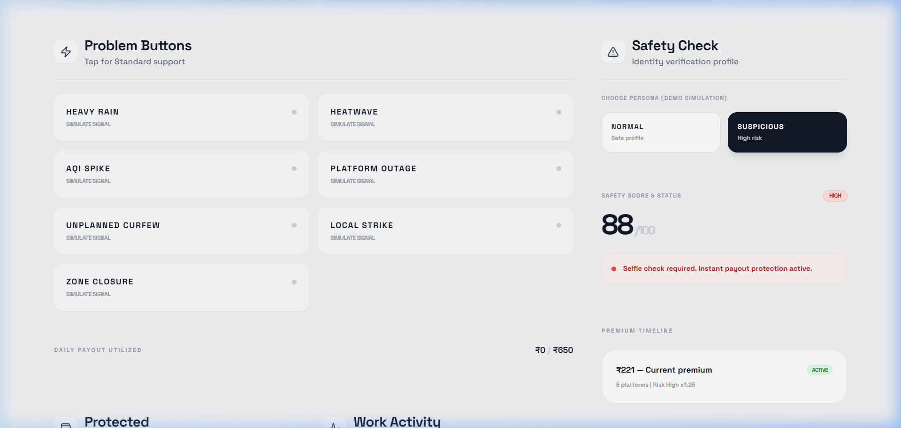
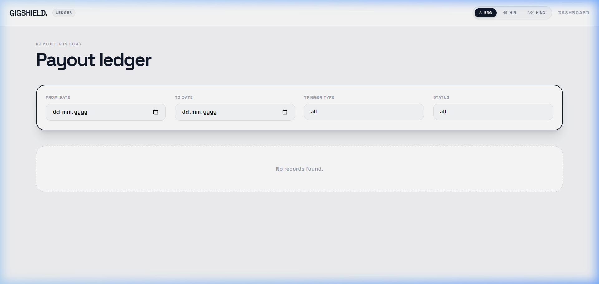
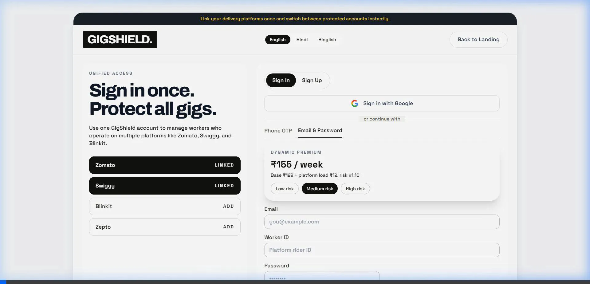

#YOUTUBE :- https://youtu.be/OH6pftc2VHI?si=1HlTYfvVnnz0QuSy

# GigShield

GigShield is a simple income protection website for gig delivery workers.

In plain words:
- If a real disruption happens (rain, heatwave, pollution spike, curfew, strike, zone closure, platform outage), the system can trigger support payout.
- The worker does not fill long claim forms for each event.
- The system checks fraud and policy rules, then processes payout lifecycle automatically.

This project is designed for workers from platforms like Zomato, Swiggy, Zepto, Amazon, Dunzo, and similar models.

## Modernized Dashboard Experience

GigShield has been updated with a **full-screen, minimalist design system** and a **dynamic real-time pricing engine**. The new UI focuses on edge-to-edge visuals, high-contrast typography, and interactive platform management.

### ⚡ Live Dynamic Pricing
The weekly premium now updates instantly as you select/deselect work apps (Blinkit, Swiggy, Zepto, etc.) and change your risk persona.


*Behold: 5 platforms active with a High Risk multiplier resulting in a ₹221 adjusted premium.*

### 📊 Flattened Payout Ledger
The transaction history has been flattened for a cleaner, high-density look, making it easier to track settlements across all your gig platforms.



### 🎨 Premium Aesthetic
The new design language uses glassmorphism and subtle micro-animations to provide a "private-jet" inspired experience for every delivery rider.



## What Problem It Solves

Delivery workers can lose income during uncontrollable disruptions.
GigShield provides a weekly-priced parametric protection model so workers get a safety net when income drops due to external events.

## What Is Covered and Not Covered

Covered domains:
- Environmental disruptions (heavy rain, heatwave, AQI spike)
- Social disruptions (curfew, local strike, zone closure)
- Platform disruptions (platform outage)

Strictly excluded:
- Health coverage
- Life coverage
- Accident coverage
- Vehicle repair coverage

Policy exclusion is enforced in code before payout calculation.

## Main Features in Layman Language

1. Simple onboarding
- Worker signs up/signs in.
- Selects linked delivery apps.
- Picks plan and sees weekly premium immediately.

2. Weekly pricing model
- Premium is always shown in weekly format.
- Price changes based on selected plan, number of apps, and risk level.

3. Trigger-based automatic claims
- Worker or system trigger starts payout evaluation.
- No long manual claim form needed for each event.

4. Smart fraud safety checks
- Risk scoring (low/medium/high)
- Liveness checks for high-risk claims (gesture + random prompts)
- Device fingerprint and velocity checks
- Geo-consistency checks
- Duplicate and cooldown trigger prevention

5. Full payout lifecycle
- Pending Verification
- Verified
- Processing
- Settled
- Failed

6. Payout history and receipts
- Filter by date, trigger type, and status
- Download JSON/PDF receipt
- Retry failed payouts with clear reason code

7. Dashboard intelligence
- Why this payout amount (formula-style explanation)
- Weekly trend chart
- Claim simulation (what-if payout)
- Plan recommendation card
- Event audit timeline

8. Notifications and mobile UX
- In-app notifications for approved/failed/settled states
- Mobile quick action bar (Trigger, Verify, Receive, History)
- Onboarding wizard explaining payout flow

9. Admin operations panel
- Queue of flagged claims
- Approve/reject actions
- Override logs
- Fraud analytics and SLA metrics

10. Integration-ready architecture
- Weather API with fallback
- Traffic data adapter (mock)
- Platform status adapter (simulated)
- Payment flow simulated with lifecycle states

## End-to-End Workflow (Step by Step)

### Workflow A: Worker Onboarding and Plan Setup
1. Worker opens Auth page.
2. Links platforms and chooses risk context.
3. System calculates weekly premium in real time.
4. Session starts with role and token context.

### Workflow B: Trigger to Claim
1. Trigger event comes from simulation or monitoring.
2. System checks policy domain first (including strict exclusions).
3. System checks plan validity, coverage hours, and daily cap.
4. System applies cooldown/dedup rules for repeated events.
5. If valid, claim is created automatically as payout receipt.

### Workflow C: Risk and Verification
1. System computes risk level.
2. Low/Medium risk: fast path.
3. High risk: stricter verification path.
4. Verification evidence includes liveness, location, and challenge completion.

### Workflow D: Payout Settlement
1. Receipt moves to processing.
2. Security checks run (token mode if enabled, velocity, geo, liveness as applicable).
3. If passed, lifecycle moves to settled.
4. If failed, lifecycle moves to failed with reason code.

### Workflow E: History and Audit
1. Every receipt is saved and upserted into history.
2. History page supports filters.
3. Trigger audit timeline records decision trail.
4. Admin panel can manually override and logs each override.

## Pages and What Each Page Does

- Landing: product summary and navigation
- Product: plain-language product explanation
- Pricing: weekly plans and dynamic premium preview
- Trigger: trigger catalog and payout rules
- Fraud Guard: fraud logic overview
- Auth: onboarding and login/signup
- Dashboard: live operations center for worker and demo
- Payout: verification, lifecycle progression, settlement
- Payout Received: confirmation + downloads
- Payout History: searchable ledger
- Admin Ops: flagged queue, analytics, override controls

## AI/ML and Intelligence Components

Current intelligence in this project is practical and explainable:
- Dynamic risk scoring and risk bands
- Confidence scoring for triggers
- Rule-based anti-fraud checks
- Predictive-style payout simulation

Note:
This is AI-enabled for product behavior and fraud controls. It is not yet a full external model training/inference pipeline.

## Production Readiness Status

Already added:
- Backend persistence scaffold with Supabase fallback strategy
- Role-based route protection
- Token-aware request structure
- Observability event tracking
- Unit and flow-style tests

Still mock/simulated in this demo:
- Real payment rails
- Full backend-only persistence migration
- Full ML model lifecycle infrastructure

## Quick Start

Prerequisites:
- Node.js 18+
- npm

Run locally:

```bash
npm install
npm run dev
```

Build:

```bash
npm run build
npm run preview
```

Test:

```bash
npm run test
```

## Scripts

```bash
npm run dev
npm run build
npm run preview
npm run lint
npm run test
npm run test:watch
```

## Final Summary for Non-Technical Readers

GigShield is a worker-first income safety website.

It watches outside disruptions that workers cannot control, checks rules and fraud signals, and gives quick support payout through a transparent flow.

Most importantly, it follows two core principles:
- Weekly pricing for gig worker reality
- No coverage for health, life, accidents, or vehicle repair
